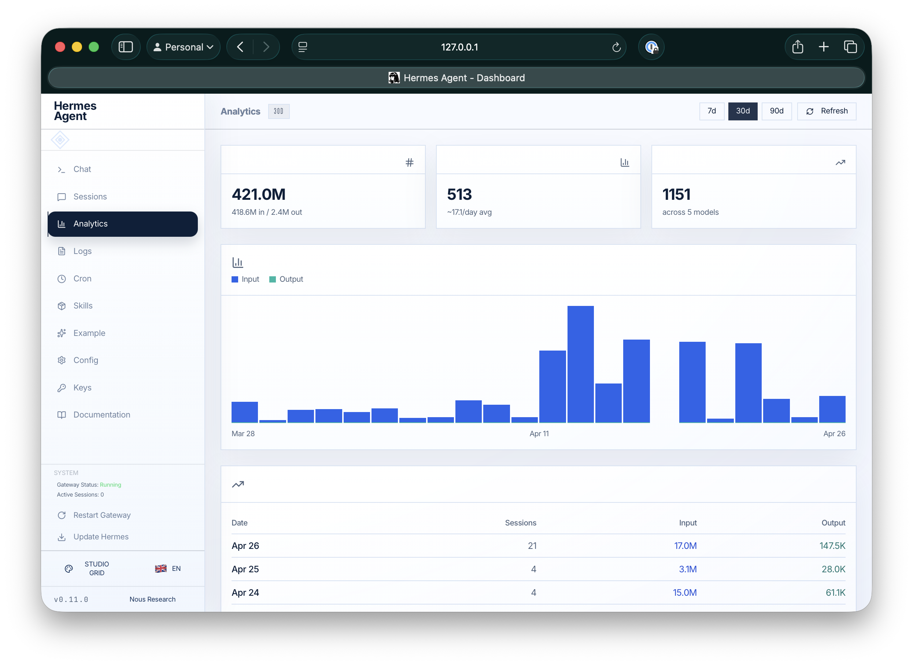
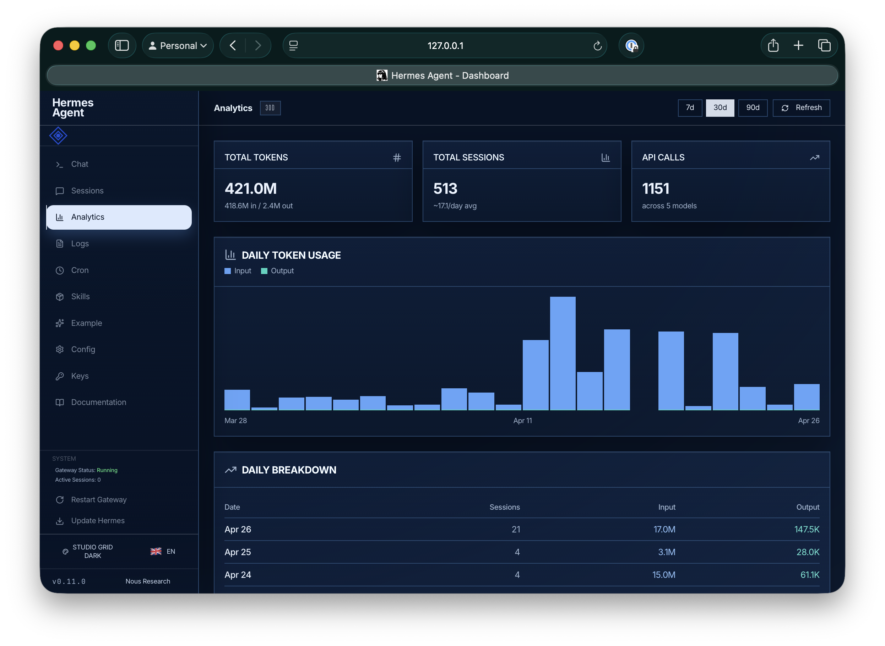

# Hermes Theme: Studio Grid

Studio Grid is a paired light and dark theme set for the Hermes dashboard. It gives the dashboard a clean technical workspace feel with crisp cards, navy and blue contrast, subtle grid accents, and analytics-friendly teal highlights.

The project contains two custom Hermes dashboard themes:

- `studio-grid`: light white/navy theme with blue grid accents
- `studio-grid-dark`: inverted deep navy theme with blue grid accents and teal analytics highlights

## Preview

### Studio Grid



### Studio Grid Dark



These themes are designed for the official Hermes web dashboard, including pages like:

- Analytics
- Sessions
- Cron
- Logs
- Config
- Skills

They use the Hermes custom theme system rather than replacing or forking the dashboard.

## Files

```text
themes/
├── studio-grid.yaml
└── studio-grid-dark.yaml
```

Each YAML file is a complete Hermes dashboard theme definition.

## Requirements

- Hermes Agent with dashboard custom theme support
- A local Hermes config directory, usually `~/.hermes`
- The Hermes dashboard, usually available at `http://127.0.0.1:9119`

## Install

Clone or download this repository, then run:

```bash
./install.sh
```

Or copy the theme files manually into your Hermes dashboard themes directory:

```bash
mkdir -p ~/.hermes/dashboard-themes
cp themes/studio-grid.yaml ~/.hermes/dashboard-themes/
cp themes/studio-grid-dark.yaml ~/.hermes/dashboard-themes/
```

Restart or refresh the Hermes dashboard. The themes should appear in the dashboard theme picker.

## Activate a theme

You can activate either theme from the dashboard theme switcher.

If you prefer to set it manually, edit `~/.hermes/config.yaml` and set:

```yaml
dashboard:
  theme: studio-grid
```

or:

```yaml
dashboard:
  theme: studio-grid-dark
```

Then restart or refresh the Hermes dashboard.

## Verify installation

If your dashboard server is running, you can check the available themes API:

```bash
curl http://127.0.0.1:9119/api/dashboard/themes
```

Look for `studio-grid` and `studio-grid-dark` in the returned theme list.

## Update

To update an existing installation, pull the latest version of this repository and copy the YAML files again:

```bash
git pull
cp themes/*.yaml ~/.hermes/dashboard-themes/
```

Refresh the dashboard afterward.

## Troubleshooting

If the themes do not show up:

1. Confirm the files are in `~/.hermes/dashboard-themes/`.
2. Confirm each file ends in `.yaml`.
3. Restart the Hermes dashboard process.
4. Check the themes API at `http://127.0.0.1:9119/api/dashboard/themes`.
5. Confirm your Hermes version includes dashboard custom theme support.

If the theme appears but some colors look wrong, the dashboard may have changed class names or hard-coded styles. The theme files include `customCSS` overrides for known dashboard surfaces and charts, but future dashboard changes may require small selector updates.

## Development

Edit the YAML files in `themes/`, then copy them into your local Hermes themes directory for testing:

```bash
cp themes/*.yaml ~/.hermes/dashboard-themes/
```

Refresh the dashboard and inspect the pages you care about.

## License

MIT
